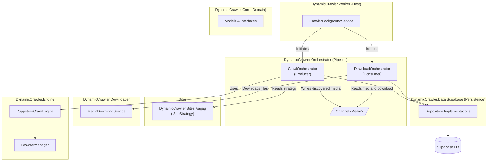

# Dynamic-Crawler

Dynamic-Crawler는 자바스크립트 렌더링이 필수적인 동적 웹사이트에서 데이터를 수집하고(게시판, 미디어, 댓글), `Supabase`와 같은 저장소에 영속화하며, 미디어(이미지, 동영상 등)를 폴링 다운로드하는 고성능 .NET 기반 크롤링 파이프라인 솔루션입니다.

## 🏗 아키텍처 및 프로젝트 구성 (Architecture & Projects)

본 솔루션은 관심사 분리(SoC) 패턴을 적용하여 여러 레이어로 나뉘어져 있습니다. 핵심 도메인은 순수하게 유지하고, 크롤링, 다운로드, 스케줄링, DB 영속성을 각각 독립적인 모듈로 구성하였습니다.

## 📂 서브 프로젝트 가이드

각 서브 프로젝트의 상세한 역할은 폴더 내의 `README.md`를 참고하십시오.

1. [**DynamicCrawler.Core**](src/DynamicCrawler.Core/README.md) : 순수 도메인 모델, 공통 Enum, `Result<T>` 및 시스템 내 모든 핵심 인터페이스를 정의합니다.
2. [**DynamicCrawler.Data.Supabase**](src/DynamicCrawler.Data.Supabase/README.md) : `Core`의 Persistence 인터페이스를 적용한 Supabase 전용 영속성 계층입니다.
3. [**DynamicCrawler.Downloader**](src/DynamicCrawler.Downloader/README.md) : IHttpClientFactory와 Polly 단위의 복원력을 적용하여 미디어를 안전하게 내려받고 중복(SHA256)을 방해합니다.
4. [**DynamicCrawler.Engine**](src/DynamicCrawler.Engine/README.md) : `PuppeteerSharp` 기반 Headless 크롤링 엔진이며 브라우저 통제(자원 및 타임아웃 방어) 전반을 담당합니다.
5. [**DynamicCrawler.Orchestrator**](src/DynamicCrawler.Orchestrator/README.md) : 스케줄링(Scheduler)과 크롤러-다운로더 간 `Channel<T>` 형태의 고성능 파이프라인을 구축합니다.
6. [**DynamicCrawler.Worker**](src/DynamicCrawler.Worker/README.md) : .NET Host로, Serilog 로깅, Windows Service 설정, 모든 의존성 주입(DI) 컨테이너 등록 및 시스템 진입점입니다.
7. [**DynamicCrawler.Sites.Aagag**](src/Sites/DynamicCrawler.Sites.Aagag/README.md) : 플러그인 형태로 aagag.com 대상 전용 `ISiteStrategy` 파싱 로직을 보유하고 있습니다.
8. [**DynamicCrawler.Tests**](tests/DynamicCrawler.Tests/README.md) : 핵심 로직(Result Pattern, Mapper, Mapper) 및 Orchestrator 롤백 시나리오를 통합 검증하는 테스트 프로젝트입니다.

---

> 이 저장소의 산출물 구조 및 비즈니스 기능 요구사항 등 상세 문서는 `docs/` 디렉터리에 분리되어 있습니다.
