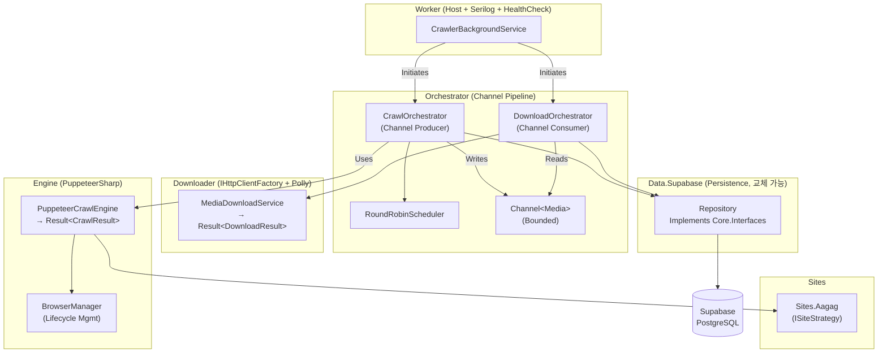

# Dynamic-Crawler 솔루션 구성, 역할 및 아키텍처

## 1. 솔루션 프로젝트 구성 (8개 프로젝트)

Dynamic-Crawler는 관심사의 분리(Separation of Concerns)와 의존성 역전 원칙(DIP)을 준수하는 모듈형 아키텍처로 설계되었습니다.

| 프로젝트 | 역할 및 특징 |
|----------|-------------|
| **`DynamicCrawler.Core`** | 도메인 엔티티(`Post`, `Media`, `Site`), 상태 Enum(`PostStatus`), `Result<T>` 패턴, 공통 인터페이스(`IRepository`, `ISiteStrategy` 등)가 정의된 핵심 레이어입니다. 외부 의존성이 전혀 없는(Zero Dependency) 순수 C# 라이브러리입니다. |
| **`DynamicCrawler.Data.Supabase`** | Core의 Persistence 인터페이스를 구현하며, Supabase(PostgreSQL 기반)와 통신합니다. 매퍼(Mapper) 적용 및 RPC 호출, `OnConflict` 제약 병합 로직 등을 처리합니다. |
| **`DynamicCrawler.Engine`** | PuppeteerSharp를 래핑하여 Headless 크롤링을 전담합니다. `BrowserManager`를 통해 인스턴스 재사용/유휴 종료를 제어하고, 네트워크 리소스를 차단(Network Optimizer)해 성능을 최적화합니다. |
| **`DynamicCrawler.Downloader`** | `IHttpClientFactory` 및 Polly를 결합한 미디어 파이프라인 전용 모듈입니다. 다운로드 성공 시 파일 데이터의 SHA256을 검출하여 중복된 미디어를 스토리지에서 배제합니다. |
| **`DynamicCrawler.Orchestrator`** | `Channel<T>` 기반 고성능 Producer-Consumer 파이프라인의 조율자입니다. 브라우저 크롤링 과정에서 도출된 리소스를 곧바로 다운로더 채널에 밀어넣어 CPU와 I/O를 병렬로 사용하게 합니다. |
| **`DynamicCrawler.Worker`** | 런타임 호스트(Host) 역할을 수행하며, `Serilog` 파일 로깅 초기화, Windows Service 등록, 의존성 주입(DI) 통합 세팅, 백그라운드 서비스 시작 등을 총괄합니다. |
| **`DynamicCrawler.Sites.Aagag`** | `ISiteStrategy`를 상속하여 타겟 도메인(`aagag.com`) 전용 HTML 파싱(목록, 미디어, 댓글 추출)을 독자적으로 수행하는 플러그인 모듈입니다. |
| **`DynamicCrawler.Tests`** | Core, Mappers, 및 Orchestrator(BackgroundService) 등의 로직 검증을 위해 `InMemory` Repository Fake를 포함하는 xUnit 기반의 테스트 프레임워크입니다. |

---

## 2. 핵심 아키텍처 다이어그램 (Architecture)

---

## 3. 핵심 파이프라인 흐름

1. **Host Bootstrapping**
   - `Worker`가 시작되며, `CrawlerBackgroundService`가 구동 전 과거 비정상 종료된(Orphaned) `Collecting / Downloading` 항목들에 대해 DB 롤백(Rollback)을 수행합니다.
2. **Crawl Orchestration (Producer)**
   - 스케줄러가 활성 상태의 `Site`를 탐색하고 `CrawlOrchestrator`를 작동시킵니다.
   - Puppeteer를 활용해 DOM을 로드하고, `ISiteStrategy`를 통해 미디어 및 게시글을 추출하여 DB에 Upsert 합니다.
   - 이때 발견된 `Media` 객체 목록은 `Channel<Media>`(비동기 파이프라인)로 전송(Write)됩니다.
3. **Download Orchestration (Consumer)**
   - `DownloadOrchestrator`는 `Channel<Media>`에서 대상 미디어를 폴링(Poll)합니다.
   - `MediaDownloadService`가 물리적 디스크 저장을 완료(SHA256 연산 포함)하면 관련된 상태 모델을 업데이트(Update)하여 영속화합니다.
4. **Resilience & Fault Tolerance**
   - 작업이 Timeout(`LeaseSeconds` 초과) 상태에 진입하거나, Anti-bot 정책(Captcha) 등으로 진행이 막혀 오류가 도출되면, 오류 정보를 반영 후 `RetryCount`를 증가시켜 다음 사이클에 다시 시도하는 견고한 재시도 메커니즘을 내장하고 있습니다.
