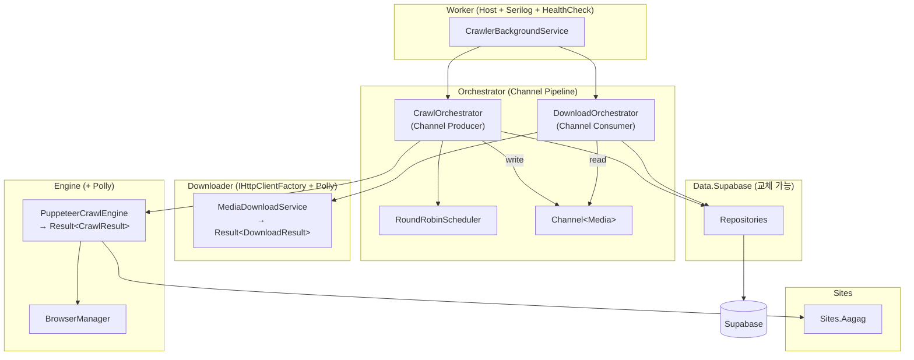

# Dynamic-Crawler: 최종 구현 계획 (스킬 리뷰 반영)

최종 설계(SDD) + 4개 .NET 스킬 비판적 검토 결과를 반영한 구현 계획입니다.

---

## 핵심 변경 (리뷰 반영)

| 개선 | 적용 |
|------|------|
| sealed class + record DTO | Core 전체 |
| Result\<T\> 에러 처리 | 크롤링/다운로드 반환값 |
| IOptions\<T\> 패턴 | 모든 설정 클래스 |
| Polly 복원력 | HTTP 호출 + Supabase RPC |
| IHttpClientFactory | Downloader |
| Serilog 구조적 로깅 | Worker |
| Health Check | Supabase + Browser |
| ~~IUnitOfWork~~ 제거 | Repository 직접 주입 |
| Channel\<T\> 파이프라인 | Orchestrator |
| ConfigureAwait(false) | 라이브러리 프로젝트 |

---

## 프로젝트 구조

```
Dynamic-Crawler/
├── DynamicCrawler.sln
├── Directory.Build.props              # net10.0, Nullable, ConfigureAwait
├── Directory.Packages.props
├── src/
│   ├── DynamicCrawler.Core/           # 순수 도메인 (의존성 0)
│   ├── DynamicCrawler.Data.Supabase/  # Supabase 구현체 (교체 가능)
│   ├── DynamicCrawler.Engine/         # PuppeteerSharp 크롤링
│   ├── DynamicCrawler.Downloader/     # 미디어 다운로드
│   ├── DynamicCrawler.Orchestrator/   # Channel 파이프라인 + 스케줄링
│   ├── DynamicCrawler.Worker/         # Host + Serilog + HealthCheck
│   └── Sites/
│       └── DynamicCrawler.Sites.Aagag/
├── sql/
│   ├── 001_create_tables.sql
│   └── 002_create_functions.sql
└── tests/
    └── DynamicCrawler.Tests/
```

---

## Proposed Changes

### 1. 빌드 인프라

#### [NEW] [Directory.Build.props](file:///d:/sources/github/Dynamic-Crawler/Directory.Build.props)
```xml
<Project>
  <PropertyGroup>
    <TargetFramework>net10.0</TargetFramework>
    <Nullable>enable</Nullable>
    <ImplicitUsings>enable</ImplicitUsings>
    <TreatWarningsAsErrors>true</TreatWarningsAsErrors>
  </PropertyGroup>
</Project>
```

#### [NEW] [Directory.Packages.props](file:///d:/sources/github/Dynamic-Crawler/Directory.Packages.props)
`Supabase`, `PuppeteerSharp`, `Polly.Extensions.Http`, `Serilog.AspNetCore`, `Microsoft.Extensions.Hosting.WindowsServices`, `xunit`, `FluentAssertions`, `Moq`

---

### 2. DynamicCrawler.Core — 순수 도메인

#### [NEW] [DynamicCrawler.Core.csproj](file:///d:/sources/github/Dynamic-Crawler/src/DynamicCrawler.Core/DynamicCrawler.Core.csproj)
외부 의존성 없음

**엔티티 (sealed + required/init):**
```csharp
public sealed class Post
{
    public long Id { get; init; }
    public required string SiteKey { get; init; }
    public required string ExternalId { get; init; }
    public required string Url { get; init; }
    public string? Title { get; init; }
    public PostStatus Status { get; set; } = PostStatus.Discovered;
    public int RetryCount { get; set; }
    public DateTime? NextRetryAt { get; set; }
    public DateTime? LeaseUntil { get; set; }
    public DateTime CreatedAt { get; init; } = DateTime.UtcNow;
}
```

**Result\<T\>:**
```csharp
public sealed class Result<T>
{
    public bool IsSuccess { get; }
    public T? Value { get; }
    public string? Error { get; }
    public string? ErrorCode { get; }
    public static Result<T> Success(T value) => ...;
    public static Result<T> Failure(string error, string? code = null) => ...;
}
```

**Record DTO:**
```csharp
public sealed record CrawlResult(
    IReadOnlyList<DiscoveredMedia> Media,
    IReadOnlyList<DiscoveredComment> Comments);

public sealed record DownloadResult(
    string Sha256, long ByteSize, string ContentType, string LocalPath);

public sealed record DiscoveredMedia(string Url, string? ContentType);
public sealed record DiscoveredComment(string Author, string Content, DateTime? CreatedAt);
```

**Repository 인터페이스 (IUnitOfWork 없이 직접 주입):**
```csharp
public interface IPostRepository
{
    Task<Result<Post>> ClaimNextAsync(string siteKey, int leaseSeconds, CancellationToken ct);
    Task UpdateStatusAsync(long postId, PostStatus status, CancellationToken ct);
    Task BulkUpsertAsync(IEnumerable<Post> posts, CancellationToken ct);
    Task<int> RollbackOrphanedAsync(CancellationToken ct);
}

public interface IMediaRepository
{
    Task<Result<Media>> ClaimNextAsync(string siteKey, int leaseSeconds, CancellationToken ct);
    Task UpdateAsync(Media media, CancellationToken ct);
    Task BulkInsertAsync(IEnumerable<Media> mediaList, CancellationToken ct);
    Task<bool> ExistsBySha256Async(string sha256, CancellationToken ct);
}

public interface ISiteRepository
{
    Task<IReadOnlyList<Site>> GetActiveSitesAsync(CancellationToken ct);
}
```

**IOptions 기반 설정:**
```csharp
public sealed class CrawlerSettings
{
    public const string SectionName = "Crawler";
    public string StorageRoot { get; set; } = @"D:\CrawlerData";
    public int DefaultMaxDownloads { get; set; } = 4;
    public int BrowserRecycleCount { get; set; } = 50;
    public int IdleTimeoutMinutes { get; set; } = 10;
    public int LeaseSeconds { get; set; } = 300;
}
```

| 파일 | 설명 |
|------|------|
| `Models/Site.cs, Post.cs, Media.cs, Comment.cs` | sealed POCO |
| `Enums/PostStatus.cs, MediaStatus.cs` | 상태 enum |
| `Common/Result.cs` | Result\<T\> 패턴 |
| `Interfaces/I*Repository.cs` | Persistence 추상화 |
| `Interfaces/ICrawlEngine.cs, ISiteStrategy.cs, IMediaDownloader.cs` | 크롤링 |
| `Configuration/CrawlerSettings.cs` | IOptions 기반 설정 |
| `Results/*.cs` | record DTO |

---

### 3. DynamicCrawler.Data.Supabase — Supabase 구현 (교체 가능)

#### [NEW] [DynamicCrawler.Data.Supabase.csproj](file:///d:/sources/github/Dynamic-Crawler/src/DynamicCrawler.Data.Supabase/DynamicCrawler.Data.Supabase.csproj)

| 파일 | 설명 |
|------|------|
| `Models/Supabase*.cs` | BaseModel 전용 모델 |
| `Mappers/*Mapper.cs` | Core POCO ↔ Supabase 매핑 |
| `Repositories/Supabase*Repository.cs` | IRepository 구현 (Postgrest + RPC) |
| `SupabaseSettings.cs` | Supabase URL/Key (IOptions) |
| `ServiceCollectionExtensions.cs` | `services.AddSupabasePersistence()` |
| `SupabaseHealthCheck.cs` | Health Check 구현 |

---

### 4. DynamicCrawler.Engine — 크롤링

| 파일 | 설명 |
|------|------|
| `BrowserManager.cs` | sealed, IDisposable, N건 재기동 |
| `PuppeteerCrawlEngine.cs` | `Task<Result<CrawlResult>>` 반환 |
| `NetworkOptimizer.cs` | CDPSession 최적화 |
| `CommentLoader.cs` | 페이지네이션 |

---

### 5. DynamicCrawler.Downloader — 다운로드

#### IHttpClientFactory + Polly 적용:
```csharp
// 서비스 등록
services.AddHttpClient("MediaDownloader")
    .AddTransientHttpErrorPolicy(p => p.WaitAndRetryAsync(
        3, attempt => TimeSpan.FromSeconds(Math.Pow(2, attempt))))
    .AddTransientHttpErrorPolicy(p => p.CircuitBreakerAsync(
        handledEventsAllowedBeforeBreaking: 5,
        durationOfBreak: TimeSpan.FromSeconds(30)));
```

```csharp
public sealed class MediaDownloadService(
    IHttpClientFactory httpClientFactory,
    IOptions<CrawlerSettings> settings,
    IMediaRepository mediaRepo,
    ILogger<MediaDownloadService> logger) : IMediaDownloader { ... }
```

| 파일 | 설명 |
|------|------|
| `MediaDownloadService.cs` | IHttpClientFactory + Polly |
| `HashHelper.cs` | SHA256 |
| `PathResolver.cs` | 경로 템플릿 |
| `DedupService.cs` | SHA256 중복 방지 |
| `ContentTypeMapper.cs` | 확장 가능 매핑 |

---

### 6. DynamicCrawler.Orchestrator — ★ Channel\<T\> 파이프라인

```csharp
// 크롤링 → 다운로드 간 Channel 파이프라인
public sealed class CrawlPipeline
{
    private readonly Channel<Media> _downloadChannel =
        Channel.CreateBounded<Media>(new BoundedChannelOptions(100)
        {
            FullMode = BoundedChannelFullMode.Wait
        });

    // Producer: 크롤러가 미디어 발견 → channel 쓰기
    // Consumer: 다운로더가 channel 읽기 → 병렬 다운로드
}
```

| 파일 | 설명 |
|------|------|
| `RoundRobinScheduler.cs` | Idle 회피 |
| `CrawlOrchestrator.cs` | Channel Producer |
| `DownloadOrchestrator.cs` | Channel Consumer |
| `CrawlPipeline.cs` | Channel\<T\> 파이프라인 관리 |
| `SiteStrategyRegistry.cs` | ISiteStrategy 자동 발견 |

---

### 7. DynamicCrawler.Worker — Host

```csharp
// Program.cs (Serilog + Health Check + 장애 복구)
var builder = Host.CreateApplicationBuilder(args);
builder.Services.AddWindowsService();

// Serilog
builder.Host.UseSerilog((ctx, cfg) => cfg
    .ReadFrom.Configuration(ctx.Configuration)
    .WriteTo.Console()
    .WriteTo.File("logs/crawler-.log", rollingInterval: RollingInterval.Day));

// Health Check
builder.Services.AddHealthChecks()
    .AddCheck<SupabaseHealthCheck>("supabase")
    .AddCheck<BrowserHealthCheck>("browser");

// DI
builder.Services.Configure<CrawlerSettings>(
    builder.Configuration.GetSection(CrawlerSettings.SectionName));
builder.Services.AddSupabasePersistence(builder.Configuration);
builder.Services.AddAagagSiteStrategy();
builder.Services.AddHostedService<CrawlerBackgroundService>();
```

```csharp
// BackgroundService (Scoped Service 패턴)
public sealed class CrawlerBackgroundService(
    IServiceScopeFactory scopeFactory,
    ILogger<CrawlerBackgroundService> logger) : BackgroundService
{
    protected override async Task ExecuteAsync(CancellationToken stoppingToken)
    {
        // 시작 시 orphaned 상태 롤백
        using (var scope = scopeFactory.CreateScope())
        {
            var postRepo = scope.ServiceProvider.GetRequiredService<IPostRepository>();
            var rolled = await postRepo.RollbackOrphanedAsync(stoppingToken);
            logger.LogInformation("Rolled back {Count} orphaned tasks", rolled);
        }

        while (!stoppingToken.IsCancellationRequested)
        {
            using var scope = scopeFactory.CreateScope();
            var orchestrator = scope.ServiceProvider
                .GetRequiredService<CrawlOrchestrator>();
            await orchestrator.RunCycleAsync(stoppingToken);
        }
    }
}
```

---

### 8. Sites.Aagag — 이전과 동일

---

### 9. 테스트 — 강화

| 파일 | 설명 |
|------|------|
| `Fakes/InMemoryPostRepository.cs` | IPostRepository 인메모리 구현 |
| `Fakes/InMemoryMediaRepository.cs` | IMediaRepository 인메모리 구현 |
| `*Tests.cs` | FluentAssertions 사용 |

---

## 아키텍처



---

## Verification Plan

### 자동화
```powershell
chcp 65001 >$null; dotnet build DynamicCrawler.sln
dotnet test --verbosity normal
```

### 수동
1. Supabase SQL 실행 → 테이블/함수 생성
2. Worker 기동 → Health Check 확인
3. 크롤링 → DB 데이터 + 로그 확인
4. 다운로드 → SHA256 파일 + dedup 확인
